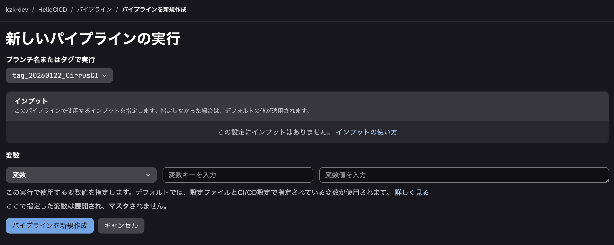
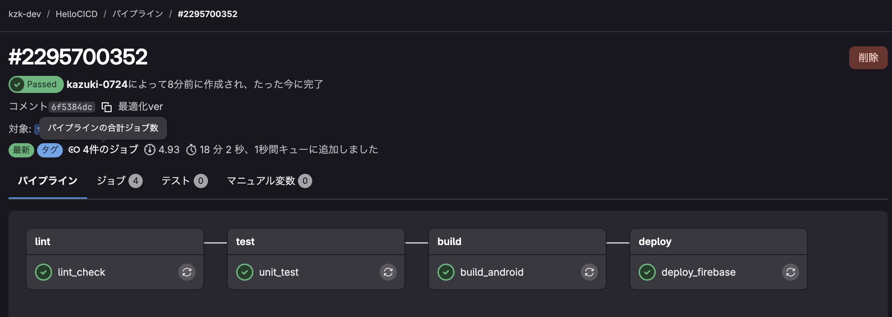
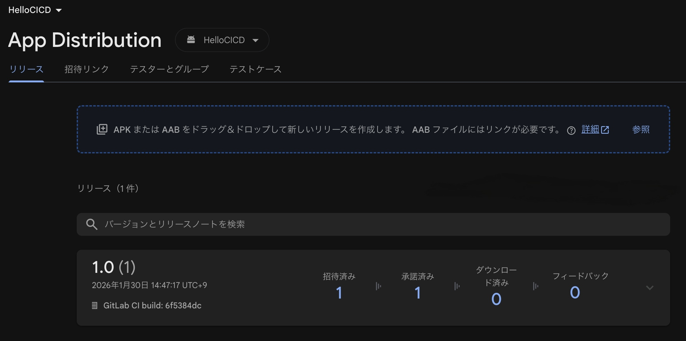
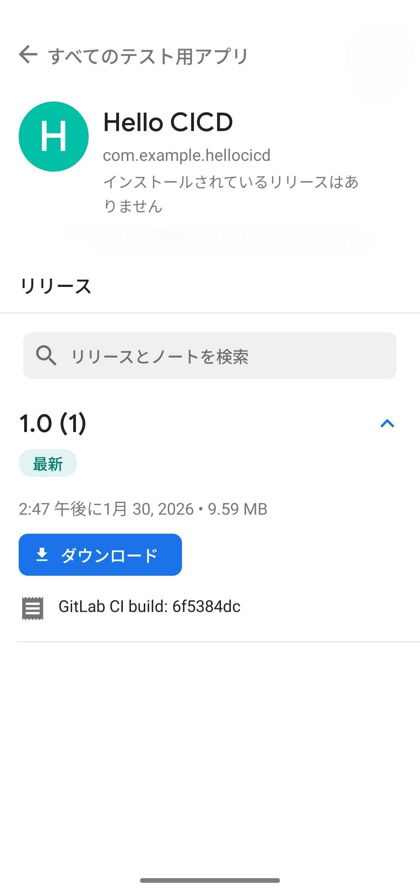

# Android CI/CD導入マニュアル

- [Android CI/CD導入マニュアル](#android-cicd導入マニュアル)
  - [はじめに](#はじめに)
  - [本資料のゴール](#本資料のゴール)
  - [必要な知識](#必要な知識)
  - [前提条件](#前提条件)
  - [導入後のアプリ配信フロー](#導入後のアプリ配信フロー)
  - [CI/CDの概要](#cicdの概要)
    - [導入にあたっての準備](#導入にあたっての準備)
      - [ビルドバリアントの確認](#ビルドバリアントの確認)
      - [CI/CD変数の設定](#cicd変数の設定)
  - [CI/CDスクリプトの構成](#cicdスクリプトの構成)
    - [ジョブ定義に関する説明](#ジョブ定義に関する説明)
    - [ステージの定義](#ステージの定義)
    - [Dockerイメージの定義](#dockerイメージの定義)
    - [静的解析 (Lint)](#静的解析-lint)
    - [ユニットテスト (Unit Test)](#ユニットテスト-unit-test)
    - [ビルド](#ビルド)
    - [デプロイ](#デプロイ)
    - [スクリプト全体像](#スクリプト全体像)
  - [参考資料](#参考資料)

## はじめに
本資料は、GitLab CI/CDを利用してAndroidアプリケーションのビルドからデプロイまでを自動化するプロセスの導入手順を解説するものである。
サンプルプロジェクトをベースに、具体的な実現方法を説明する。

## 本資料のゴール
GitLab CI/CDを使い、AndroidアプリのビルドからFirebase App Distributionへのデプロイまでを自動化するパイプラインスクリプトを作成できるようになること。

## 必要な知識
1.  GitLab CI/CDに関する基本的な知識
2.  Androidのビルド設定（`build.gradle`）に関する知識
3.  Firebase App Distributionに関する基本的な知識

## 前提条件
1.  対象のAndroidプロジェクトにFirebaseが導入済みであること。
2.  ソースコードのバージョン管理をGitLabで行っていること。
3.  GitLabプロジェクトのCI/CD変数を編集する権限を持っていること。

## 導入後のアプリ配信フロー
従来の手動によるビルド、検証環境へのアップロード、アプリ配信といったフローを、CI/CDの導入によって以下のように改善できる。
開発者が行う作業はパイプラインの実行のみとなり、その後のプロセスはCI/CDによって自動化される。
また、ビルド環境がDockerコンテナに統一されるため、開発者ごとの環境差異によるトラブルを未然に防ぐことができる。


1.  GitLab上でパイプラインを手動または自動で実行する。


2.  パイプラインが完了するまで待つ。

3.  Firebase App Distributionに新しいバージョンのアプリが配信される。

<!--  -->

## CI/CDの概要
本資料におけるCI/CDのスコープは以下の通り。
*   **CI (Continuous Integration)**: 静的解析、テスト、ビルド
*   **CD (Continuous Delivery/Deployment)**: デプロイ

### 導入にあたっての準備

#### ビルドバリアントの確認
モジュールレベルの`build.gradle`ファイルを参照し、CI/CDで利用したいビルドタイプ（例: `debug`, `release`）を確認する。
Gradleタスクはビルドバリアントと組み合わせて利用する。例えば、`debug`ビルドでAPKを作成したい場合は`assembleDebug`、AABを作成したい場合は`bundleDebug`を実行する。
`release`ビルドの場合は、タスク名の`Debug`が`Release`に置き換わる（例: `assembleRelease`）。

```gradle
// app/build.gradle

android {
    // ...
    buildTypes {
        release {
            minifyEnabled false
            proguardFiles getDefaultProguardFile('proguard-android-optimize.txt'), 'proguard-rules.pro'
        }
        // 'debug' はデフォルトで定義されている
    }
}
```

#### CI/CD変数の設定
セキュリティ情報など、リポジトリに直接含めたくない値はGitLabのCI/CD変数として設定する。

1.  **Firebaseサービスアカウントキー (`FIREBASE_SERVICE_ACCOUNT_KEY_B64`)**
    Firebaseコンソールの「プロジェクトの設定 > サービスアカウント」から新しい秘密鍵を生成し、ダウンロードしたJSONファイルの中身全体を**Base64エンコード**する。エンコードした文字列をCI/CD変数として設定する。

2.  **FirebaseアプリID (`FIREBASE_APP_ID`)**
    Firebaseコンソールの「プロジェクトの設定」から対象アプリの「アプリID」をコピーし、CI/CD変数として設定する。

## CI/CDスクリプトの構成
`.gitlab-ci.yml`ファイルにCI/CDのパイプラインを定義する。

#### ジョブ定義に関する説明
**※以下は構成の一例である。プロジェクトの要件に応じて内容は適宜変更。**

#### ステージの定義
`stages`キーワードで、パイプラインで実行するジョブの順序を定義する（必須ではないが推奨）。
ここでは、静的解析、テスト、ビルド、デプロイの順でステージを定義する。

```yml
stages:
  - lint
  - test
  - build
  - deploy
```

#### Dockerイメージの定義
`image`キーワードで、CI/CDジョブを実行するDockerイメージを指定する。
ここでは、一般的なAndroid開発に必要なツールが含まれた`cimg/android`イメージを利用する。プロジェクトで利用するAndroid APIレベルやNode.jsのバージョンに応じて、最適なイメージのタグを選択する必要がある。

```yml
default:
  image: cimg/android:2026.01.1-node
```

#### 静的解析 (Lint)
`lint`タスクを実行し、コード品質をチェックする。`artifacts`を指定することで、ジョブの成果物（ここではHTMLレポート）を保存し、GitLabのUIからダウンロードできるようになる。

```yml
lint_check:
  stage: lint
  script:
    - ./gradlew lintDebug
  artifacts:
    when: always
    paths:
      - app/build/reports/lint-results-debug.html
    expire_in: 1 week
```

#### ユニットテスト (Unit Test)
`test`タスクを実行し、ユニットテストを実施する。`reports: junit`を指定することで、テスト結果をGitLabのUI上で視覚的に確認できるようになる。

```yml
unit_test:
  stage: test
  script:
    - ./gradlew testDebugUnitTest
  artifacts:
    when: always
    reports:
      junit: app/build/test-results/testDebugUnitTest/TEST-*.xml
    paths:
      - app/build/reports/tests/testDebugUnitTest/
    expire_in: 1 week
```

#### ビルド
`assemble`または`bundle`タスクを実行し、APKまたはAABファイルを生成する。この成果物は後続の`deploy`ジョブで利用するため、`artifacts`として出力しておく。ストレージの圧迫を防ぐため、有効期限（`expire_in`）は短めに設定することが推奨される。

```yml
build_android:
  stage: build
  script:
    - ./gradlew assembleDebug
  artifacts:
    paths:
      - app/build/outputs/apk/debug/app-debug.apk
    expire_in: 1 hour
```

#### デプロイ
`build`ステージで生成されたアプリファイルを、Firebase App Distributionにアップロードする。
デプロイ処理の核となるのは`firebase appdistribution:distribute`コマンド。
`--groups`には、配信先のテスターグループ名を指定する。`"group"`の部分は実際のグループ名に置き換える必要がある。

```yml
deploy_firebase:
  stage: deploy
  dependencies:
    - build_android
  script:
    - echo "$FIREBASE_SERVICE_ACCOUNT_KEY_B64" | base64 -d > /tmp/key.json
    - export GOOGLE_APPLICATION_CREDENTIALS=/tmp/key.json
    - |
      npx --yes firebase-tools appdistribution:distribute app/build/outputs/apk/debug/app-debug.apk \
        --app "$FIREBASE_APP_ID" \
        --release-notes "GitLab CI build: $CI_COMMIT_SHORT_SHA" \
        --groups "group"
```

### スクリプト全体像
以下は、これまで説明した内容をまとめた`.gitlab-ci.yml`の全体像である。キャッシュ設定などを追加し、より実践的な内容になっている。

```yml
# ----------------------------------------
# パイプライン全体の実行条件
# ----------------------------------------
workflow:
  rules:
    - if: '$CI_PIPELINE_SOURCE == "web"' # GitLabのWeb UIから手動実行された場合のみ
      when: always
    - when: never # 上記以外は実行しない

stages:
  - lint
  - test
  - build
  - deploy

# ----------------------------------------
# 共通設定 & 変数定義
# ----------------------------------------
default:
  image: cimg/android:2026.01.1-node
  before_script:
    - rm -f  .gradle/caches/modules-2/modules-2.lock
    - rm -fr .gradle/caches/*/plugin-resolution/

variables:
  GRADLE_USER_HOME: "$CI_PROJECT_DIR/.gradle"
  GRADLE_OPTS: "-Dorg.gradle.daemon=false"

cache:
  key: "$CI_COMMIT_REF_SLUG-android"
  paths:
    - .gradle/wrapper
    - .gradle/caches
  policy: pull-push

# ----------------------------------------
# 1. 静的解析 (Lint)
# ----------------------------------------
lint_check:
  stage: lint
  script:
    - ./gradlew lintDebug
  artifacts:
    when: always
    paths:
      - app/build/reports/lint-results-debug.html
    expire_in: 1 week

# ----------------------------------------
# 2. ユニットテスト (Unit Test)
# ----------------------------------------
unit_test:
  stage: test
  script:
    - ./gradlew testDebugUnitTest
  artifacts:
    when: always
    reports:
      junit: app/build/test-results/testDebugUnitTest/TEST-*.xml
    paths:
      - app/build/reports/tests/testDebugUnitTest/
    expire_in: 1 week

# ----------------------------------------
# 3. Androidアプリのビルド (APK生成)
# ----------------------------------------
build_android:
  stage: build
  script:
    - ./gradlew assembleDebug
  artifacts:
    paths:
      - app/build/outputs/apk/debug/app-debug.apk
    expire_in: 1 hour

# ----------------------------------------
# 4. Firebase App Distributionへアップロード
# ----------------------------------------
deploy_firebase:
  stage: deploy
  dependencies:
    - build_android
  cache: # deployジョブではビルドキャッシュは不要なため、pullのみに設定
    key: "$CI_COMMIT_REF_SLUG-android"
    policy: pull
  script:
    - echo "$FIREBASE_SERVICE_ACCOUNT_KEY_B64" | base64 -d > /tmp/key.json
    - export GOOGLE_APPLICATION_CREDENTIALS=/tmp/key.json
    - |
      npx --yes firebase-tools appdistribution:distribute app/build/outputs/apk/debug/app-debug.apk \
        --app "$FIREBASE_APP_ID" \
        --release-notes "GitLab CI build from commit $CI_COMMIT_SHORT_SHA" \
        --groups "testers" # 'testers'は実際のテスターグループ名に置き換えてください
```

## 参考資料
*   [GitLab CI/CD Documentation](https://docs.gitlab.com/ee/ci/)
*   [Firebase App Distribution CLI Reference](https://firebase.google.com/docs/app-distribution/cli-reference)